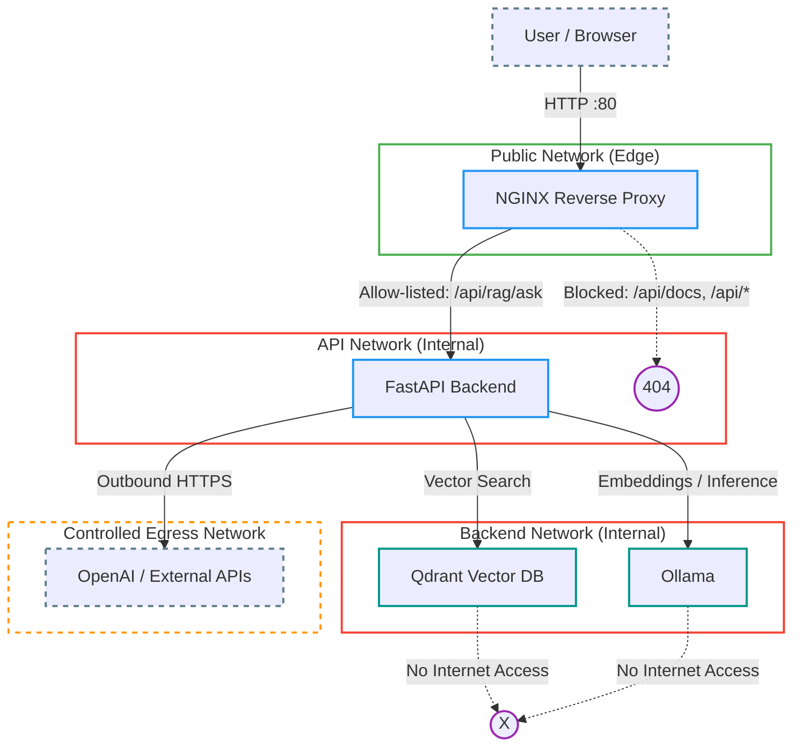

# Full-Stack RAG Application

This repository contains a complete, containerized **Retrieval-Augmented Generation (RAG)** application. It combines a high-performance **FastAPI** backend with a modern **Flutter** frontend, orchestrating **Qdrant** (Vector DB) and **Ollama** (Embeddings/LLM) services.

## 🏗️ Architecture

The application is composed of four main services managed via Docker Compose:

| Service | Directory | Description | Port (Host) | Internal Network |
| :--- | :--- | :--- | :--- | :--- |
| **Frontend** | `/ui` | Flutter Web application serving the user interface. | `80` | `frontend_net`, `api_net` |
| **Backend** | `/app` | FastAPI service handling RAG logic and API requests. | *Internal Only* | `api_net`, `backend_net`, `llm_net` |
| **Vector DB** | `/db` | Qdrant instance for storing document embeddings. | *Internal* | `backend_net` |
| **Embedder** | `/embedder` | Ollama service for generating embeddings and running LLMs. | *Internal* | `backend_net` |

### Networking



### 🔐 Security Architecture & Visualization

The architecture diagram above uses a comprehensive color-coding scheme to represent security zones and component roles. This visual strategy ensures instant recognition of trust boundaries.

**Color Legend & Rationale**

| Scope | Color | Meaning | Rationale |
| :--- | :--- | :--- | :--- |
| **Public Zone** | **Green** | Publicly Accessible | Safe entry point for user traffic (Edge). |
| **Private Zone** | **Red** | **High Security** | Strictly internal. No direct external access allowed to protect critical data (`Qdrant`) and logic (`Ollama`). |
| **Egress Zone** | **Orange** | Controlled Access | Outbound-only traffic channel to specific external services (e.g., OpenAI). |
| **Services** | **Blue** | Compute Logic | Stateless containers processing requests (`Nginx`, `API`). |
| **Data / AI** | **Teal** | State & Models | Critical assets requiring the highest level of protection and persistence. |
| **External** | **Grey** | Untrusted | Entities outside our infrastructure control (`User`, `Internet`). |
| **Blocked** | **Purple** | **Access Denied** | Explicitly blocked paths (e.g., direct DB access or sensitive API docs exposure). |

### 🛡️ Network Policy Reference
-   **Isolation by Design**: By placing the Database and LLM in the **Red** `backend_net`, we cryptographically guarantee they cannot be reached by the `Frontend` or the `Public` internet.
-   **Reverse Proxy Control**: `Nginx` (**Green**) acts as the only gatekeeper, allowing only specific routes (e.g., `/api/rag/ask`) while blocking sensitive endpoints (`/docs`, `/metrics`).

### 🐳 Docker Networks Explained
A **Docker Network** is a virtual, software-defined channel that allows specific containers to communicate while isolating them from others. We use separate networks to strictly limit the "blast radius" of any potential breach.

-   **`frontend_net`**: Bridged network connecting the host/user to the Frontend container.
-   **`api_net`**: Internal network connecting the Nginx proxy to the Backend API.
-   **`backend_net`**: Deeply isolated internal network for Backend <-> DB/Embedder communication.
-   **`llm_net`**: Dedicated bridge network for external LLM connectivity.

## 🚀 Features

-   **Full-Stack Solution**: Ready-to-deploy architecture with Frontend, Backend, and AI services.
-   **Production-Ready Backend**: Async FastAPI with LangChain integration.
-   **Cross-Platform Frontend**: Flutter-based UI targeting Web (Dockerized) and Mobile/Desktop.
-   **Private & Local**: Uses local embeddings (Ollama) and a self-hosted vector store (Qdrant).
-   **Scalable**: Containerized Environment with isolated networks.

## 🛠️ Prerequisites

-   **Docker** & **Docker Compose** (Required for the full stack).
-   **Python 3.13+** (For local backend development).
-   **Flutter SDK** (For local frontend development).

## 🏁 Quick Start (Docker Compose)

Get the entire application running in minutes.

### 1. Configuration

1.  **Root Configuration**:
    Ensure the `.env` file in the root directory exists. It defines the URL the frontend uses to contact the backend.
    ```env
    # .env
    BACKEND_URL=http://localhost:8088
    ```

2.  **Backend Configuration**:
    The backend uses `app/.env/.env` for Docker settings. Ensure it is configured (see `app/README.md` for details).
    ```env
    # app/.env/.env (Example)
    OLLAMA_URL=http://embedder_container:11434
    QDRANT_URL=http://vector_db_container:6333
    OPENAI_API_KEY=sk-...
    ```

### 2. Run the Stack

Execute the following from the root directory:

```bash
docker compose up --build
```

### 3. Access the Application

-   **Frontend**: Open [http://localhost](http://localhost) in your browser.
-   **Backend API**: Access documentation at [http://localhost:8088/docs](http://localhost:8088/docs).

## 📂 Project Structure

```plaintext
rag-app/
├── .env                    # Root config used by Docker Compose (Frontend build args)
├── .github/                # CI/CD Workflows
├── compose.yaml            # Main orchestration file
├── README.Docker.md        # Extended Docker instructions
├── app/                    # Backend Service
│   ├── .env/               # Environment variables (.env & .env.local)
│   ├── notebooks/          # Jupyter notebooks
│   ├── src/                # FastAPI source code
│   ├── test/               # Test suite
│   ├── Dockerfile          # Backend container definition
│   └── uv.lock             # Dependency lock file
├── ui/                     # Frontend Service
│   ├── config/             # Nginx configuration
│   ├── lib/                # Flutter source code
│   └── Dockerfile          # Frontend container definition
├── db/                     # Data persistence for Qdrant
│   └── data/               # Mapped volume
└── embedder/               # Embedder Service
    ├── Dockerfile          # Ollama container definition
    └── data/               # Mapped volume (models, etc.)
```

## 💻 Local Development

If you wish to develop individual components separately:

-   **Backend Development**: See [app/README.md](app/README.md)
    *   Runs on port `8000`.
    *   Uses `app/.env/.env.local`.
-   **Frontend Development**: See [ui/README.md](ui/README.md)
    *   Runs on port `8888`.
    *   Uses `dart-define` for configuration.

## 🐳 Docker Details

For specific details on how the containers are built and run:
-   **Backend Docker**: [app/README.Docker.md](app/README.Docker.md)
-   **Frontend Docker**: [ui/README.Docker.md](ui/README.Docker.md)
