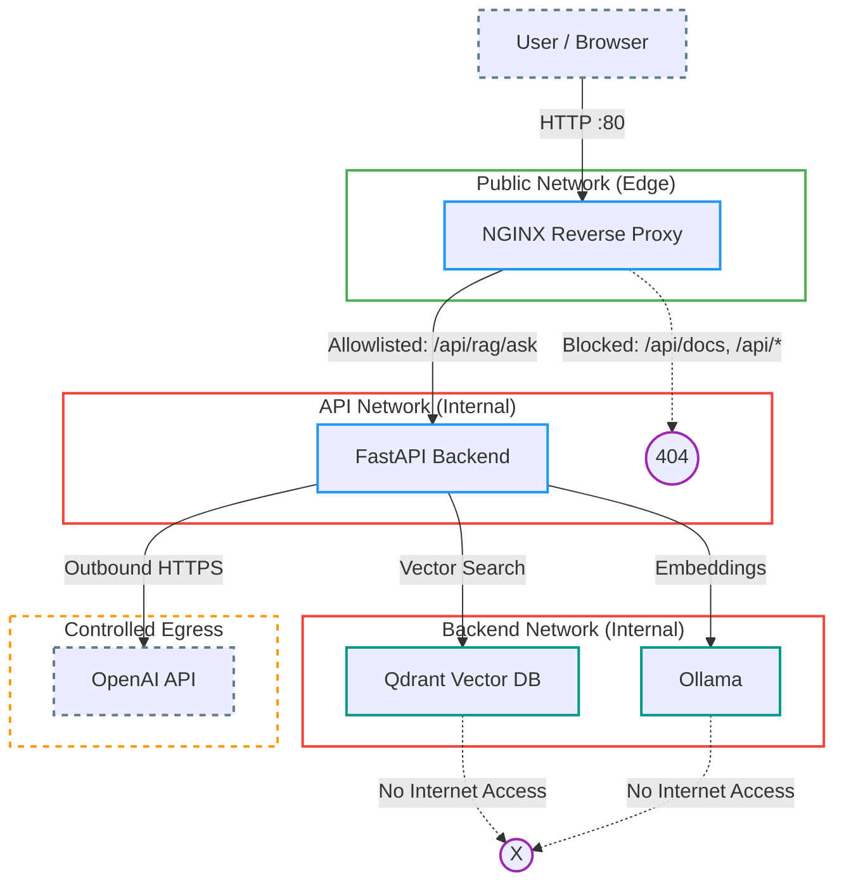

# Codebase RAG Application

A production-grade **Retrieval-Augmented Generation (RAG)** system built from the ground up — combining local embeddings, a vector database, and GPT-4o into a fully containerized, secure, full-stack application.

> **Built to demonstrate end-to-end AI engineering:** LLM integration, vector search, embedding pipelines, LangChain orchestration, fine-tuning infrastructure, and MLOps tooling — all deployed via Docker with CI/CD.


---

## What It Does

Users upload documents through the Flutter frontend. The system chunks, embeds, and indexes them in Qdrant. When a question is asked, the pipeline performs semantic similarity search to retrieve the most relevant chunks and feeds them as context to GPT-4o, which generates a grounded, citation-aware answer.

```
Document Upload → Chunking → Embedding (Ollama) → Qdrant Storage
                                                          ↓
User Query → Embedding → Semantic Search → Top-3 Chunks → GPT-4o → Answer
```

---

## AI & ML Architecture

### RAG Pipeline

| Stage | Component | Detail |
| :--- | :--- | :--- |
| **Chunking** | LangChain `RecursiveCharacterTextSplitter` | 1,000-char chunks, 100-char overlap |
| **Embeddings** | Ollama `nomic-embed-text` | 768-dimensional vectors, runs locally |
| **Vector Store** | Qdrant | Cosine similarity, async client |
| **Retrieval** | Qdrant semantic search | Top-3 most relevant chunks |
| **Generation** | OpenAI GPT-4o | Context-grounded, hallucination-constrained prompt |
| **Orchestration** | LangChain LCEL | Composable chain: Retriever → Prompt → LLM → Parser |

### LangChain Chain (LCEL)

```python
chain = (
    {"context": retriever | format_docs, "question": RunnablePassthrough()}
    | custom_prompt          # system + human message template
    | llm                    # ChatOpenAI (GPT-4o)
    | StrOutputParser()
)
```

### Prompt Engineering

The system prompt is engineered to:
- Ground answers strictly in retrieved context
- Prevent hallucination ("do not make up information not in the context")
- Require citation of source documents in responses

### Fine-Tuning Infrastructure

The repo includes a full fine-tuning setup for the embedding model:

- `app/notebooks/embedder_tuning.ipynb` — embedding model fine-tuning experiments
- `app/notebooks/embedder_test.ipynb` — evaluation and benchmarking
- **Dependencies:** `sentence-transformers`, `accelerate`, `datasets`, `mlflow`
- **MLflow** integration for experiment tracking and artifact versioning
- `checkpoints/` directory for saving model snapshots

---

## System Architecture

### Service Composition

| Service | Stack | Responsibility | Port |
| :--- | :--- | :--- | :--- |
| **Frontend** | Flutter Web + Nginx | User interface & reverse proxy | `80` |
| **Backend** | FastAPI + LangChain | RAG pipeline, API, embedding orchestration | Internal |
| **Vector DB** | Qdrant | Store & query document embeddings | Internal |
| **Embedder** | Ollama (`nomic-embed-text`) | Local, private text embeddings | Internal |

### Network Security



**Security design:**
- Qdrant and Ollama have **zero internet exposure** — isolated in `backend_net`
- Nginx allowlists only `/api/rag/ask`, blocking `/docs`, `/metrics`, and all other API routes from the public
- GPT-4o traffic routes through a **dedicated egress network** — no cross-contamination with internal services
- All containers run as **non-root users**

---

## Tech Stack

### Backend
| | Technology | Purpose |
| :--- | :--- | :--- |
| Language | Python 3.13 | Core runtime |
| Framework | FastAPI (async) | REST API with OpenAPI docs |
| AI Orchestration | LangChain LCEL | Composable LLM chains |
| LLM | OpenAI GPT-4o | Answer generation |
| Embeddings | Ollama `nomic-embed-text` | Local 768-dim vector embeddings |
| Vector DB Client | `qdrant-client` (async) | Vector search |
| Package Manager | `uv` | Fast, reproducible dependency management |
| Type Checking | `mypy` | Static type safety |
| Linting | `ruff` | Formatting + linting |
| Fine-tuning | `sentence-transformers`, `mlflow` | Custom embedding model training |

### Frontend
| | Technology |
| :--- | :--- |
| Framework | Flutter 3.10+ (Dart) |
| Design | Material Design 3 (dark theme) |
| HTTP | `http` package |
| Deployment | Nginx (Alpine) |

### Infrastructure
| | Technology |
| :--- | :--- |
| Orchestration | Docker Compose |
| CI/CD | GitHub Actions |
| Vector Database | Qdrant |
| Embeddings Runtime | Ollama 0.15.1 |

---

## API Reference

All endpoints are versioned under `/api/v1/`.

| Endpoint | Method | Description |
| :--- | :--- | :--- |
| `/health` | `GET` | Service health check |
| `/collections` | `GET` | List all Qdrant collections |
| `/collections` | `POST` | Create a new collection (768-dim, cosine) |
| `/collections` | `DELETE` | Delete a collection |
| `/documents/add` | `POST` | Upload, chunk & embed documents |
| `/documents/query` | `POST` | Raw semantic search |
| `/embed` | `POST` | Generate embeddings for arbitrary text |
| `/rag/ask` | `POST` | **Core RAG endpoint** — retrieves context, calls GPT-4o |

---

## Quick Start

### Prerequisites

- Docker & Docker Compose
- An OpenAI API key

### 1. Configure Environment

**Root `.env`:**
```env
BACKEND_URL=http://localhost:80
```

**`app/.env/.env`:**
```env
OLLAMA_URL=http://embedder_container:11434
QDRANT_URL=http://vector_db_container:6333
FLUTTER_URL=http://localhost:80
LOCAL_URL=http://localhost
OPENAI_API_KEY=sk-...
```

### 2. Run the Stack

```bash
docker compose up --build
```

### 3. Use the App

| Interface | URL |
| :--- | :--- |
| Frontend UI | http://localhost |
| Backend API Docs | http://localhost:8088/docs |

---

## Project Structure

```
RAG_App/
├── .github/workflows/
│   └── quality_checks.yaml     # CI: Ruff lint/format + mypy
├── compose.yaml                 # 4-service orchestration
├── app/                         # FastAPI backend
│   ├── notebooks/
│   │   ├── embedder_test.ipynb  # Embedding evaluation
│   │   └── embedder_tuning.ipynb# Fine-tuning experiments
│   ├── src/app/
│   │   ├── api/v1/              # Route handlers
│   │   ├── services/            # RAG, vector DB, text processing
│   │   ├── core/lifespan.py     # Startup: init LLM, embeddings, DB clients
│   │   └── utils/               # Constants, CORS, loaders
│   └── pyproject.toml           # Dependencies incl. fine-tuning extras
├── ui/
│   ├── lib/main.dart            # Flutter app
│   └── config/nginx.conf        # Reverse proxy & security rules
├── db/data/                     # Qdrant persistence volume
└── embedder/                    # Ollama service + model volume
```

---

## CI/CD

GitHub Actions runs on every push and pull request to `main` and `dev`:

1. Python 3.13.1 setup with `uv` (cached)
2. `ruff check` — linting
3. `ruff format --check` — formatting
4. `mypy` — static type checking

---

## Local Development

| Component | Command | Port |
| :--- | :--- | :--- |
| Backend | See [`app/README.md`](app/README.md) | `8000` |
| Frontend | See [`ui/README.md`](ui/README.md) | `8888` |

Local backend uses `app/.env/.env.local`; configure `OLLAMA_URL`, `QDRANT_URL`, and `OPENAI_API_KEY` to point at running services.

---

## Key Engineering Decisions

- **Local embeddings (Ollama)** — documents never leave the host; embedding costs are zero at inference time
- **Async-first backend** — both Qdrant and FastAPI operations use `async/await` for concurrency under load
- **LCEL chains** — declarative, composable pipeline makes retrieval strategy easy to swap (e.g., MMR, HyDE)
- **Fine-tuning-ready** — `sentence-transformers` + `mlflow` are first-class dependencies, not afterthoughts; the embedding model can be domain-adapted and hot-swapped without changing the retrieval interface
- **Network isolation over secrets** — internal services have no credentials to steal because they are unreachable from outside `backend_net`
